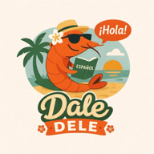

  

# DaleDele

**Practica español nivel DELE B2.**

## El Problema

Aprender gramática española avanzada es difícil. El subjuntivo, las diferencias entre pasados, ser vs estar, los condicionales — son temas que incluso estudiantes avanzados siguen confundiendo. Los libros de texto explican la teoría pero falta práctica intensiva con retroalimentación inmediata.

## La Solución

DaleDele es una PWA gamificada para practicar gramática española al nivel DELE B2. Once categorías cubren los temas más difíciles del español, desde el subjuntivo hasta los tildes. Cada ejercicio incluye una explicación detallada de por qué la respuesta es correcta.

## Para Quién

- Estudiantes de español preparando el examen DELE B2
- Hablantes avanzados que quieren perfeccionar su gramática
- Cualquiera que confunda estaba/estuvo, ser/estar, o el subjuntivo

## Tech Stack

Next.js, Supabase, Vercel, PWA

## Live

https://daledele.franciscocucullu.com

---

## Autor

**Francisco Cucullu** — Ingeniero de software e indie developer.

- Website: [franciscocucullu.com](https://franciscocucullu.com)
- LinkedIn: [linkedin.com/in/franciscocucullu](https://linkedin.com/in/franciscocucullu)
